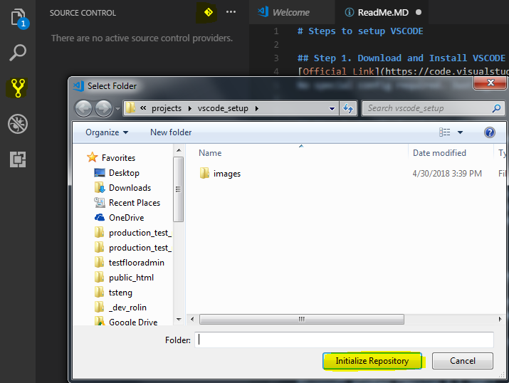

# Steps to setup VSCODE

## Step 1. Download and Install VSCODE
[Official Link](https://code.visualstudio.com/)
No special config required. Just agree and next will do.


## Step 2. Download and Install GIT.
When you see the below message under OUTPUT tab after you starts VSCODE

```
Looking for git in: C:\Program Files\Git\cmd\git.exe
Looking for git in: C:\Program Files (x86)\Git\cmd\git.exe
Looking for git in: C:\Program Files\Git\cmd\git.exe
Looking for git in: C:\Users\rolin\AppData\Local\Programs\Git\cmd\git.exe
Git installation not found.
```

[Official Link](https://git-scm.com/downloads)

1. No special config required. Just agree the licienses and click next button will do.
2. Restart VSCODE upon installation complished.
3. Verify GIT installation.
3.1 click TERMINAL tab, it will point to your working folder

```
Microsoft Windows [Version 6.1.7601]
Copyright (c) 2009 Microsoft Corporation.  All rights reserved.

C:\Users\rolin\Documents\vscode\projects\vscode_setup>git --version
git version 2.17.0.windows.1
```
## GIT repository setup

Follow below picture


OUTPUT screen will show the 
```
> git init
> git rev-parse --show-toplevel
> git config --get commit.template
Open repository: c:\Users\rolin\Documents\vscode\projects\vscode_setup
> git status -z -u
> git symbolic-ref --short HEAD
> git rev-parse master
fatal: ambiguous argument 'master': unknown revision or path not in the working tree.
Use '--' to separate paths from revisions, like this:
'git <command> [<revision>...] -- [<file>...]'
> git for-each-ref --format %(refname) %(objectname) --sort -committerdate
> git remote --verbose
> git show :ReadMe.MD
> git check-ignore -z --stdin
> git show :ReadMe.MD
```

## Create repository on the GITHUB page.
Copy the link upon finish

## connect to GITHUB

```
C:\Users\rolin\Documents\vscode\projects\vscode_setup>git remote add origin https://github.com/linrongbin/vscode_setup.git

C:\Users\rolin\Documents\vscode\projects\vscode_setup>git pull origin  master
fatal: Couldn't find remote ref master

C:\Users\rolin\Documents\vscode\projects\vscode_setup>git add README.md

C:\Users\rolin\Documents\vscode\projects\vscode_setup>git commit -m "first commit"
On branch master
nothing to commit, working tree clean

C:\Users\rolin\Documents\vscode\projects\vscode_setup>git push -u origin  master
Counting objects: 5, done.
Delta compression using up to 4 threads.
Compressing objects: 100% (3/3), done.
Writing objects: 100% (5/5), 93.61 KiB | 18.72 MiB/s, done.
Total 5 (delta 0), reused 0 (delta 0)
To https://github.com/linrongbin/vscode_setup.git
 * [new branch]      master -> master
Branch 'master' set up to track remote branch 'master' from 'origin'.

